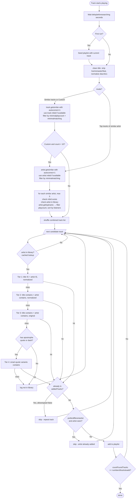

# Track Selection Logic

```mermaid
flowchart TD
    A([Track starts playing]) --> B[Wait delaybeforesearching seconds]
    B --> C{First run?}
    C -->|Yes| D[Seed playlist with current track]
    C -->|No| E
    D --> E[clean title: strip live/remaster/feat, normalize diacritics]

    E --> F{mode?}
    F -->|Similar tracks or Custom| G[track.getsimilar with autocorrect=1<br/>use track mbid if available<br/>filter by minimalplaycount + minimalmatching]
    G --> H{Custom and count < 10?}
    F -->|Top tracks of similar artist| I
    H -->|Yes| I[artist.getsimilar with autocorrect=1<br/>use artist mbid if available<br/>filter by minimalmatching]
    H -->|No| J
    I --> I2[for each similar artist, max 5<br/>check mbid exists<br/>check artist in library<br/>artist.gettoptracks → filter playcount, sort by listeners]
    I2 --> J

    J[shuffle combined track list] --> K

    K[/next candidate track/] --> L{artist in library?<br/>cached lookup}
    L -->|No| K
    L -->|Yes| M[Tier 1: title IS + artist IS, normalized]
    M -->|miss| N[Tier 2: title contains + artist contains, normalized]
    N -->|miss| O[Tier 3: title contains + artist contains, original]
    O -->|miss| P{has apostrophe<br/>quote or dash?}
    P -->|Yes| Q[Tier 4: smart-quote variants contains]
    P -->|No| R
    Q -->|miss| R[log not in library]
    M -->|hit| S
    N -->|hit| S
    O -->|hit| S
    Q -->|hit| S

    S{already in<br/>addedTracks?} -->|Yes, allowrepeat=false| T[skip - repeat track]
    S -->|No| U{preferdifferentartist<br/>and artist seen?}
    U -->|Yes| V[skip - artist already added]
    U -->|No| W[add to playlist]
    W --> X{countFoundTracks<br/>>= numberoftrackstoadd?}
    X -->|No| K
    X -->|Yes| Y([done])
    R --> K
    T --> K
    V --> K
```
